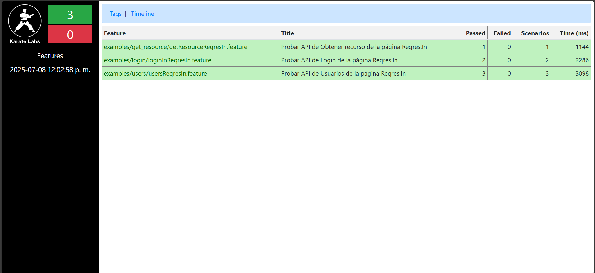
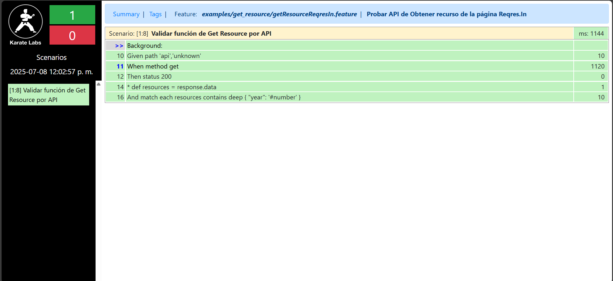
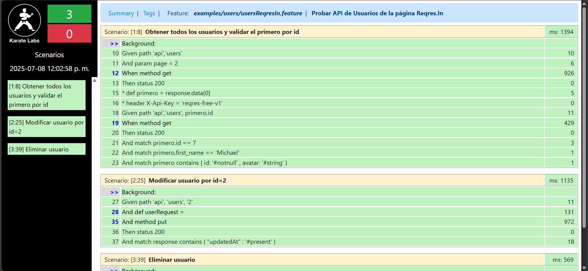

# KARATE-DEMO

## Objetivo

* Demostrar conocimiento de uso de la herramienta Karate DSL.

## Estructura

* Las clases runner pueden ser ubicadas en /src/test/java/examples/[nombre de funcionalidad a probar]/ ej: (get_resource, login, users)

|              | Propósito                                                          | Nombre de Clase                 |
|--------------|--------------------------------------------------------------------|---------------------------------|
| Get Resource | Validación de campos en arrays `match each resources contains deep`| GetResourceReqresInRunner.class |
| Login        | Manejo de variables y casos negativos (flujos alternos)            | LoginInReqresIn.class           |
| Users        | Uso de POST, GET, PUT, DELETE                                      | UsersRunner.class               |

## Ejecución

* Para ejecutar todos los casos de prueba, clone el proyecto en su equipo y por medio la consola una vez ubicado en el proyecto ejecute:

`mvn clean test`

o si desea una ejecución personalizada:

`mvn clean test -Dkarate.options="--tags @ServerRest"`

Nota: @Login puede ser reemplazado por alguna de las etiquetas internas (ej: @Users, @GetResources, etc.)

## Resultados esperados

* El reporte que se debería poder generar en `target/karate-reports/` serían:

Summary:

Get Resources:

Login:

Users:

