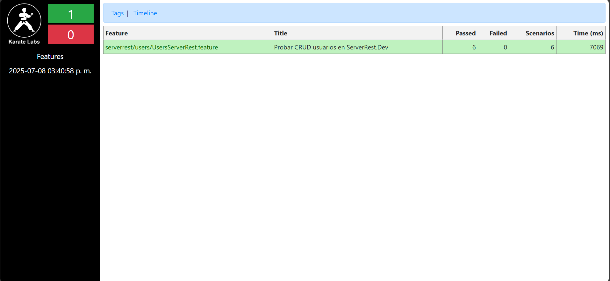
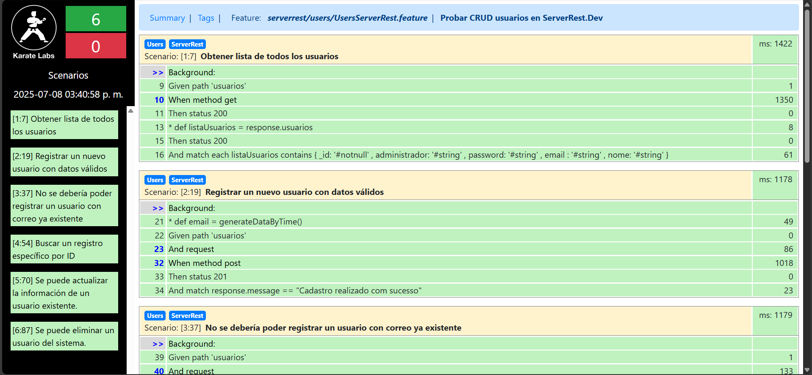

# KARATE-DEMO

## Objetivo

* Demostrar conocimiento de uso de la herramienta Karate DSL consultando a la api de https://serverest.dev/.

## Estructura

* Las clase runner puede ser ubicada en /src/test/java/serverrest/users/UsersRunner.class

* Casos de prueba:
  * Obtener lista de todos los usuarios
  * Registrar un nuevo usuario con datos válidos
  * No se debería poder registrar un usuario con correo ya existente
  * Buscar un registro específico por ID
  * Se puede actualizar la información de un usuario existente.

## Ejecución

* Para ejecutar todos los casos de prueba, clone el proyecto en su equipo y por medio la consola una vez ubicado en el proyecto ejecute:

`mvn clean test`

o si desea una ejecución personalizada:

`mvn clean test -Dkarate.options="--tags @ServerRest"`

Nota: @Login puede ser reemplazado por alguna de las etiquetas internas (ej: @Users, @GetResources, etc.)

## Resultados esperados

* El reporte que se debería poder generar en `target/karate-reports/` serían:

Summary:

